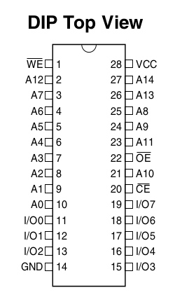

# 어셈블리와 C언어로 익히는 AT89S52 마스터
* https://www.yes24.com/Product/Goods/1971252
* OK-89S52 + SDCC + PAULMON2.1 on Linux Box
* 리펙토링 된 코드는 원작자의 의도와 다를 수 있음. (원작자에게 문의 금지)

## TOOL 설치
```bash
sudo apt install sdcc a31
```

## 보드 개조
* PAULMON2.1를 올려서 사용하기 위해서는 외부램이 필요하지만, OK-89S52는 외부 램이 존재하지 않는다.
* 사용하지 않는 AT29C256를 제거하고, 그 자리에 SRAM을 설치
* AT29C256과 62256 SRAM의 Pin-Out이 다르므로 개조가 필요
  * 아래 Pin-Out을 비교하면, _WE 와 A14의 위치가 다름
  * 배선을 다시하여, 62256이 사용 가능하도록 개조해야 함

|AT29C256|62256|
|-|-|
|||

## PAULMON2.1 준비
* *paulmon2.1* 디렉토리에서 아래 <code>make</code> 실행
* *bin/paulmon21.hex* 파일을 AT89S52에 다운로드


## 사용 방법
1. 터미널 에뮬레이터는 **19200n 8n1** 으로 설정
1. PAULMON Shell에서 <code>d</code>입력해 다운로드 모드로 설정
1. 각 예제 디렉토리에서 <code>make -j\`nproc\` upload</code> 명령을 입력해 iHEX파일을 생성하고 PAULMON으로 업로드
1. 업로드가 완료되면 PAULMON Shell에서 <code>j</code>입력해 실행


